# Site Functional Schema

This is a high-level “how the site works” schema: navigation → user flows → module interactions → core data relationships.

---

## 1) Main navigation (Apple-like)

- Explore (Tonight + Trending + Best in Genre)
- Search
- Plan (Calendar + Meal Plans)
- Cookbook (Saved)
- Me (Profile + Settings)

---

## 2) Primary user journeys (flow)

```mermaid
flowchart TD
  V[Visitor] -->|Browse| E[Explore]
  E --> TN[Tonight Card / Picks]
  TN --> R
  E --> R[Recipe Detail]
  R -->|Save| CB[Cookbook]
  R -->|Add to plan| P[Plan / Week View]
  P -->|Generate| SL[Shopping List]
  P -->|Leftover prompts| LO[Leftovers / Reuse Suggestions]

  R -->|Cook| CM[Cook Mode (step-by-step + timers)]
  CM -->|Done| HIS[Cook History (optional)]

  V -->|Login| A[OAuth: Google / Apple]
  A --> PR[Profile]

  PR -->|Follow creator| CH[Creator Channel]
  CH -->|Community| COM[Community Board]
  CH -->|Browse| CS[Creator Series / Collections]
  CS --> R

  R -->|Vote| VOTE[Votes + Leaderboards]
  E -->|Tap list| TL[Trending / Popular Lists]
  TL --> R

  %% Content creation
  PR -->|Create| SUB[Submit]
  SUB --> DRAFT[Draft]
  DRAFT --> REV[Review]
  REV -->|Approve| PUB[Published]
  REV -->|Reject| REJ[Rejected]

  %% Search
  V --> S[Search]
  S --> R
  R --> SIM[More like this (Similar Recipes)]
  SIM --> R

  %% Progressive disclosure
  PR --> SET[Settings]
  SET --> TP[Taste Preferences]
  TP --> TN
  SET -->|Enable Health Mode| HM[Health Overlays]
  HM --> P
  HM --> R
  SET -->|Enable Power Mode| PM[Pantry + Ideas]
  PM --> PAN[Pantry]
  PAN --> IDEAS[Dish Ideas]

  %% Sharing
  R -->|Share| SH[Share Recipe / QR / Link]
  SL -->|Share| SLS[Share Shopping List]
```

---

## 3) Module interaction map

```mermaid
flowchart LR
  Auth[Auth (Google / Apple)] --> Profiles[Profiles + Channels]
  Profiles --> Follows[Follows]

  Approaches[Approaches] --> Posts[Posts]
  Tags[Diet/Food Tags] --> Posts

  Posts --> Recipes[Recipe Viewer + Print]
  Recipes --> CookMode[Cook Mode + Timers]
  Posts --> Media[Shorts/Images/Videos Viewer]
  Posts --> Votes[Votes]
  Votes --> Rankings[Rankings: Trending / Popular / Best-in-Genre]
  Approaches --> Rankings
  Tags --> Rankings

  Profiles --> TastePrefs[Taste Preferences]
  TastePrefs --> Reco[Tonight Recommendations]
  Votes --> Reco
  Collections[Collections + Series] --> Reco

  Recipes --> Shares[Share Links / QR]
  Shopping --> Shares

  Submit[Submission/Editor] --> Quality[Recipe Quality Guardrails]
  Quality --> Posts

  Posts --> Search[Search + Discovery]
  Profiles --> Search

  Recipes --> Calendar[Calendar / Week View]
  Calendar --> MealPlans[Meal Plans + Entries]
  MealPlans --> Shopping[Shopping Lists]
  MealPlans --> Leftovers[Leftovers / Reuse Prompts]

  Community[Community Board] --> Moderation[Creator Moderation]
  Moderation --> Reports[Reports]
  Moderation --> Actions[Moderation Actions]
  Moderation --> Cooldowns[Strikes/Cooldowns]

  FeatureFlags[Feature Flags] --> Recipes
  FeatureFlags --> MealPlans
  FeatureFlags --> Pantry[Pantry]
  FeatureFlags --> Health[Health Tracking]
```

---

## 4) Core data relationships (ER-style)

```mermaid
erDiagram
  PROFILES {
    uuid id PK
    text handle
    text display_name
    jsonb feature_flags
    text preferred_language
    bool language_locked
  }

  USER_TASTE_PREFS {
    uuid owner_id PK
    text[] dislikes
    text[] favorites
    int spicy_preference
    bool kid_friendly_bias
    timestamp updated_at
  }

  APPROACHES {
    uuid id PK
    text name
    text slug
  }

  POSTS {
    uuid id PK
    text type
    text title
    text slug
    uuid approach_id FK
    uuid created_by FK
    text status
    jsonb recipe_json
    text video_url
    text hero_image_url
    text[] diet_tags
    text[] food_tags
    bool is_tested
    int quality_score
  }

  VOTES {
    uuid id PK
    uuid post_id FK
    uuid user_id FK
    int value
    timestamp created_at
  }

  FOLLOWS {
    uuid follower_id FK
    uuid followed_id FK
  }

  COLLECTIONS {
    uuid id PK
    uuid owner_id FK
    text name
    text type
    text visibility
    text slug
    timestamp created_at
  }

  COLLECTION_ITEMS {
    uuid collection_id FK
    uuid post_id FK
    timestamp created_at
  }

  MEAL_PLANS {
    uuid id PK
    uuid owner_id FK
    text name
    text timezone
    uuid diet_profile_id
    uuid fasting_plan_id
    int default_daily_calories_kcal
  }

  MEAL_PLAN_ENTRIES {
    uuid id PK
    uuid meal_plan_id FK
    date date
    text meal_slot
    uuid post_id FK
    numeric servings
    text servings_mode
  }

  SHOPPING_LISTS {
    uuid id PK
    uuid owner_id FK
    text name
    text source_type
    text source_ref
    date period_from
    date period_to
  }

  SHOPPING_LIST_ITEMS {
    uuid id PK
    uuid shopping_list_id FK
    text name
    numeric amount
    text unit
    bool checked
  }

  SHOPPING_LIST_SHARES {
    uuid id PK
    uuid shopping_list_id FK
    text token
    timestamp expires_at
    bool can_edit
  }

  COOK_SESSIONS {
    uuid id PK
    uuid owner_id FK
    uuid post_id FK
    timestamp started_at
    timestamp finished_at
  }

  THREADS {
    uuid id PK
    uuid channel_id FK
    uuid author_id FK
    text title
    text status
    bool is_locked
    bool is_pinned
  }

  REPLIES {
    uuid id PK
    uuid thread_id FK
    uuid author_id FK
    text status
  }

  CHANNEL_SETTINGS {
    uuid owner_id PK
    text community_mode
    text discord_invite_url
  }

  REPORTS {
    uuid id PK
    text entity_type
    text entity_id
    uuid reporter_id
    text status
    uuid scope_owner_id
  }

  MODERATION_ACTIONS {
    uuid id PK
    text entity_type
    text entity_id
    text action
    uuid acted_by
    text scope_type
    uuid scope_owner_id
  }

  USER_MODERATION_STATS {
    uuid user_id PK
    int strikes
    timestamp cooldown_until
  }

  PROFILES ||--o{ POSTS : creates
  APPROACHES ||--o{ POSTS : categorizes
  POSTS ||--o{ VOTES : receives
  PROFILES ||--o{ VOTES : casts

  PROFILES ||--o{ MEAL_PLANS : owns
  MEAL_PLANS ||--o{ MEAL_PLAN_ENTRIES : has
  POSTS ||--o{ MEAL_PLAN_ENTRIES : planned_recipe

  PROFILES ||--|| USER_TASTE_PREFS : config

  PROFILES ||--o{ COLLECTIONS : owns
  COLLECTIONS ||--o{ COLLECTION_ITEMS : has
  POSTS ||--o{ COLLECTION_ITEMS : collected

  PROFILES ||--o{ SHOPPING_LISTS : owns
  SHOPPING_LISTS ||--o{ SHOPPING_LIST_ITEMS : has
  SHOPPING_LISTS ||--o{ SHOPPING_LIST_SHARES : shares

  PROFILES ||--o{ COOK_SESSIONS : cooks
  POSTS ||--o{ COOK_SESSIONS : cooked_recipe

  PROFILES ||--o{ THREADS : channel_owner
  THREADS ||--o{ REPLIES : has
  PROFILES ||--o{ REPLIES : writes

  PROFILES ||--|| CHANNEL_SETTINGS : config

  PROFILES ||--o{ REPORTS : files
  PROFILES ||--o{ MODERATION_ACTIONS : performs
  PROFILES ||--|| USER_MODERATION_STATS : has
```



---

## 5) Progressive disclosure rules (summary)
- Mainstream users see: Explore, Save, Plan (week view), Shopping List.
- Health Mode reveals: calorie targets, macro rollups, fasting plan, auto-fit.
- Creator moderation is always available on the creator’s own channel, but kept behind a simple “…” menu (Hide/Lock/Approve).

---

## 6) Trending / popularity / best-in-genre (via votes)

These lists are first-class in **Explore** and are driven by `votes`.

- **Trending (time-decayed):** ranks recent momentum (new votes weigh more).
- **Popular (all-time or long-window):** steady “best of” ordering.
- **Best in Genre:** the same ranking, filtered by **Approach** (genre) and optionally by diet/food tags.

Suggested ranking signals (simple-by-default):
- Base: `net_votes = upvotes - downvotes` (or upvotes only, if you prefer positivity-only UX)
- Add time window: last 7/30 days for Trending
- Optional decay: $score = \frac{net\_votes}{(age\_hours + 2)^{1.2}}$ (tweak exponent later)

Implementation notes (kept lightweight):
- Enforce **one vote per user per post** (unique constraint).
- Compute lists via query or a scheduled/materialized view refresh (Postgres) for speed.
- Exclude non-`published` posts; optionally down-rank/omit posts under moderation review.

---

## 7) “Tonight” (food-first personalization)

The **Tonight** card is a small, opinionated picker that helps users decide quickly.

- Inputs (MVP): saved recipes, recent views, approach/genre, vote-driven popularity, basic taste prefs.
- Inputs (optional): time available (user setting), pantry hints (Power Mode).
- Output: 3–5 options + a single CTA: **Cook**, **Add to plan**, or **Save**.

Keep it simple:
- No heavy health logic by default.
- No substitutions/unit conversions (explicitly out of scope for now).
